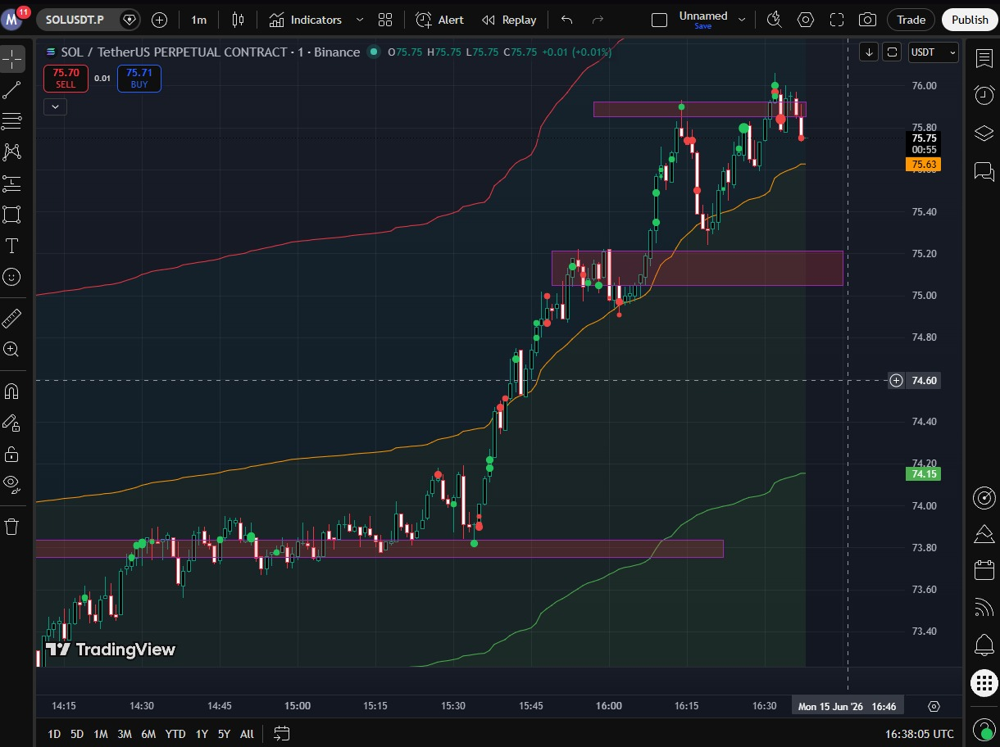
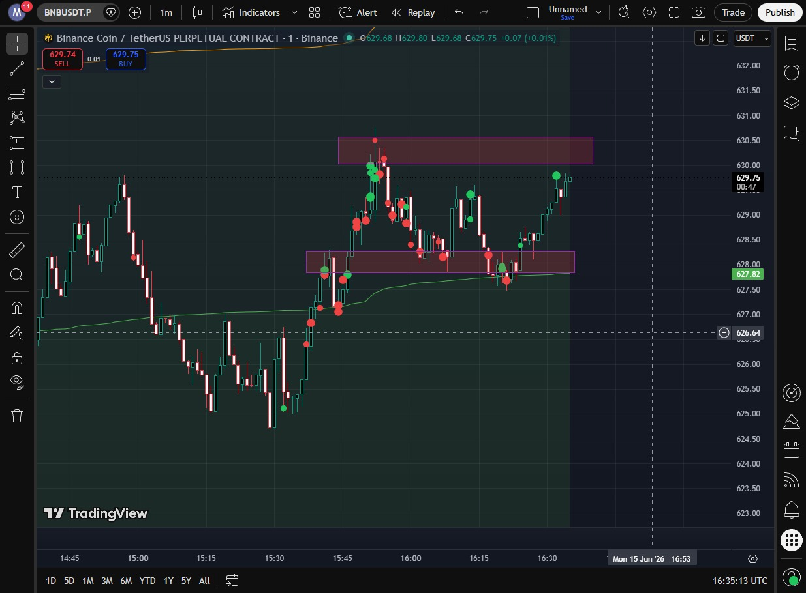
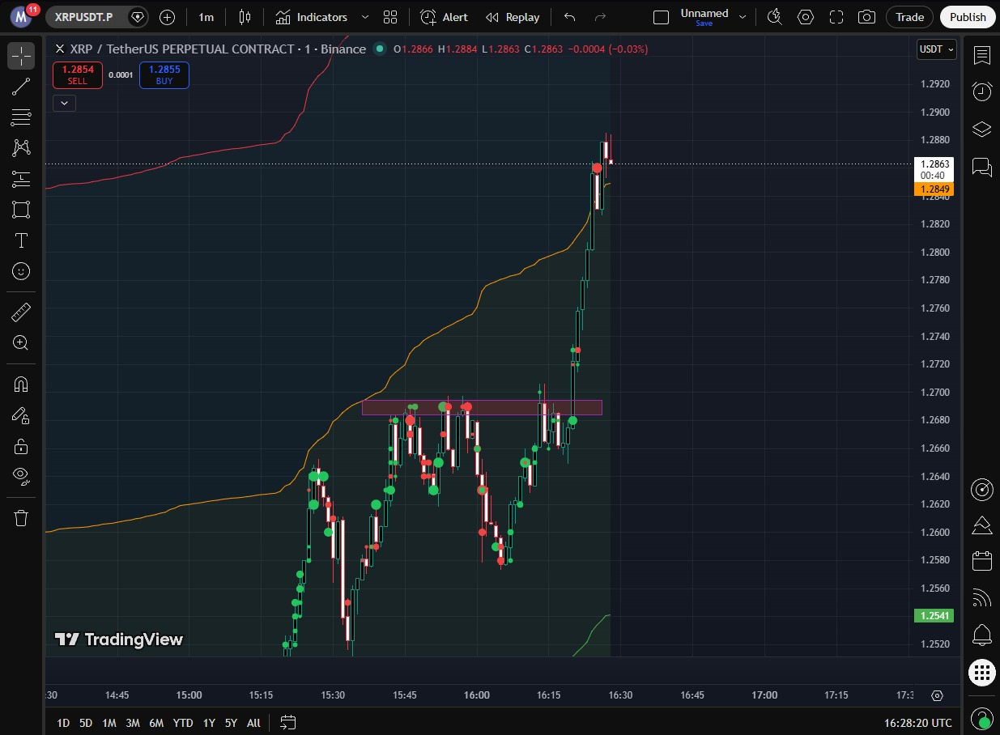

# Big Trades

[]()

Real-time Binance Futures market indicator that visualizes aggressive large market orders as colored bubbles directly on TradingView charts. Green bubbles represent aggressive buying (taker buys), red bubbles represent aggressive selling (taker sells).

Designed for scalping on 1m–15m timeframes across BTCUSDT, SOLUSDT, XRPUSDT, and BNBUSDT.

---

## Screenshots

| SOLUSDT — Active Trading | BTCUSDT — Price Levels | XRPUSDT — Market Activity |
|---|---|---|
|  |  |  |

---

## Features

- **Real-Time Bubbles** — Anomalous trade clusters appear as icons on the chart during candle formation, updated every 200ms
- **Buy/Sell Color Coding** — Green = aggressive buyers (taker buys), Red = aggressive sellers (taker sells)
- **Circle Growth** — Bubbles grow in real-time as more volume hits the same price level within the same candle
- **Z-Score Anomaly Detection** — Each price level is scored against its historical baseline; only statistically significant activity is shown
- **Dynamic Notional Filter** — Per-pair adaptive trade value filter (mean + Z * std of last 1000 trades) eliminates noise
- **Candle Volume Gating** — During high-volume candles the threshold automatically lowers, ensuring breakouts are fully visible
- **Cluster Merging** — Same price + direction + candle = one bubble that accumulates volume
- **Lock on Candle Close** — Historical anomalies are preserved with dimmed opacity
- **DeepCharts-Style Size Scaling** — Z-score maps directly to bubble size via three sliders
- **Incremental Rendering** — Only changed bubbles are redrawn, no flickering
- **Interactive Settings Panel** — Adjust all parameters live from the chart

### Settings Panel

| Setting | Range | Default | Description |
|---------|-------|---------|-------------|
| Std Dev | 1.0–10.0 | 3.0 | Controls z-score-to-size mapping; lower = more circles at max size |
| Min Size | 2–20px | 6px | Smallest bubble diameter |
| Max Size | 6–60px | 24px | Largest bubble diameter |
| Opacity | 0–100 | 0 | Bubble transparency (0 = opaque) |
| Threshold | 1.0–5.0 | 2.0 | Z-score cutoff for anomaly flagging |
| Notional Z | 1–10 | 3 | Strictness of trade value filter (higher = fewer but bigger trades) |

---

## Architecture

```
┌──────────────┐     WebSocket      ┌───────────────────┐
│  Binance     │ ──────────────────> │  Server (Node.js) │
│  Futures WS  │   market streams    │  Port 3002        │
└──────────────┘                     │                   │
                                     │  aggregator.js    │
                                     │  baseline-tracker │
                                     │  ring-buffer.js   │
                                     │  http-server.js   │
                                     └───────┬───────────┘
                                             │ HTTP (poll 200ms)
                                             │ REST (every 5s)
                                     ┌───────▼───────────┐
                                     │  TradingView      │
                                     │  + Userscript     │
                                     │  (Tampermonkey)   │
                                     └───────────────────┘
```

### Server Modules

| Module | Role |
|--------|------|
| `binance-ws.js` | WebSocket client to Binance Futures market streams |
| `aggregator.js` | Core trade processor: candle buckets, active circles, notional filter, volume gating |
| `baseline-tracker.js` | Per-price-level z-score baseline over last 5000 candles |
| `ring-buffer.js` | Circular buffer for historical candle data |
| `http-server.js` | REST API + SSE + z-score enrichment with candle volume gating |
| `backfill.js` | Loads 1500 historical klines on startup |
| `price-tick.js` | Dynamic tick rounding by price magnitude |
| `config.js` | Centralized configuration |

### Data Flow

1. **Binance WebSocket** emits trade events in real-time
2. **aggregator.addTrade()** processes each trade: notional filter, candle accumulation, cluster merging
3. **Every 200ms**: active circles are enriched with z-scores and volume-gated thresholds; fresh anomalies are pushed to the poll buffer
4. **Every 60s** (candle close): active circles are locked into the ring buffer, candle is flushed, baseline is recomputed
5. **Userscript** polls `/api/poll` every 200ms for fresh bubbles and `/api/data` every 5s for full state
6. **TradingView** renders bubbles via `chart.createShape` with Font Awesome solid circle icons

---

## Installation

### Prerequisites

- Node.js 18+
- Tampermonkey browser extension
- TradingView account (free tier works)

### Server Setup

```bash
cd server
npm install
npm start
```

The server connects to Binance Futures WebSocket and starts on `http://127.0.0.1:3002`.

### Userscript Installation

1. Open the userscript file: `userscript/main_user (10).js`
2. Copy the entire contents
3. Open Tampermonkey dashboard → Create a new script
4. Paste the contents and save
5. Refresh TradingView

> **Note:** After any server or userscript changes, delete the old script in Tampermonkey and reinstall for all changes to take effect.

---

## API Endpoints

| Endpoint | Description |
|----------|-------------|
| `GET /api/data?pair=SOLUSDT&threshold=2.0&notionalZ=3` | Full enriched dataset (historical + active circles) |
| `GET /api/poll?pair=SOLUSDT&threshold=2.0&notionalZ=3` | Fresh anomalies since last poll (cleared on read) |
| `GET /api/stream` | SSE stream for real-time anomaly push |
| `GET /api/pairs` | List of tracked pairs |
| `GET /health` | Health check |

### Response Format

```json
{
  "time": 1718000000,
  "price": 165.42,
  "buyVol": 2.5,
  "sellVol": 0,
  "ratio": 4.2,
  "isAnomaly": true,
  "isActive": true,
  "locked": false
}
```

---

## Project Structure

```
aggressive-volume-indicator/
├── server/
│   ├── src/
│   │   ├── index.js              # Entry point — WS listeners, 200ms check, 60s lock cycle
│   │   ├── aggregator.js         # Trade processor, candle buckets, active circles
│   │   ├── http-server.js        # REST API + SSE + enrichment
│   │   ├── baseline-tracker.js   # Per-level z-score baseline
│   │   ├── ring-buffer.js        # Circular candle buffer
│   │   ├── binance-ws.js         # Binance Futures WebSocket client
│   │   ├── backfill.js           # Historical kline loader
│   │   ├── price-tick.js         # Dynamic tick rounding
│   │   ├── config.js             # Configuration
│   │   └── ws-server.js          # Local WebSocket server
│   ├── tests/
│   │   ├── aggregator.test.js
│   │   ├── http-server.test.js
│   │   ├── baseline-tracker.test.js
│   │   ├── binance-ws.test.js
│   │   └── ring-buffer.test.js
│   └── package.json
├── userscript/
│   └── main_user (10).js         # Tampermonkey userscript v8.2.0
├── img/
│   ├── screenshot1.jpeg
│   ├── screenshot2.jpeg
│   └── screenshot3.jpeg
└── README.md
```

---

## Configuration

All server settings in `server/src/config.js`:

```js
{
  wsPort: 3001,
  httpPort: 3002,
  defaultPairs: ["BTCUSDT", "SOLUSDT", "XRPUSDT", "BNBUSDT"],
  candleIntervalMs: 60000,           // 1 minute candles
  maxCandlesInBuffer: 5000,          // Baseline window
  maxPriceLevelsPerCandle: 500,      // Max price levels tracked per candle
  anomalyThreshold: 2.0,             // Z-score cutoff
  minNotionalFloor: 5000,            // Initial trade value floor (USD)
}
```

---

## Key Technical Decisions

### Candle Volume Gating
During high-volume candles (breakouts), the z-score threshold is divided by `max(1, candleVolumeRatio)`. A candle with 4x normal volume has effective threshold = 2.0 / 4 = 0.5, allowing nearly every level to print. Low-volume candles are unaffected.

### Dynamic Per-Pair Notional Filter
Each pair independently tracks the last 1000 trade values. Per-trade threshold = mean + Z * std. A floor of $5,000 applies until 50 ticks are collected. The Z multiplier is user-adjustable via the Notional Z slider.

### Std Floor at 50% of Mean
Prevents near-zero standard deviations on sparse price levels from producing inflated z-scores and false positives.

### Cluster Merging
Trades at the same price level, same direction, same candle are merged into a single active circle identified by key `pair_candleTs_price_side`. Each trade adds to the circle's cumulative volume.

---

## Testing

```bash
cd server
npm test
```

26 tests passing (1 pre-existing baseline failure from std floor change). Tests cover aggregation, enrichment with volume gating, WebSocket handling, ring buffer, and baseline computation.

---

## Disclaimer

This software is for educational and research purposes only. It does not constitute financial advice. Trading cryptocurrency involves substantial risk. Past performance is not indicative of future results.
